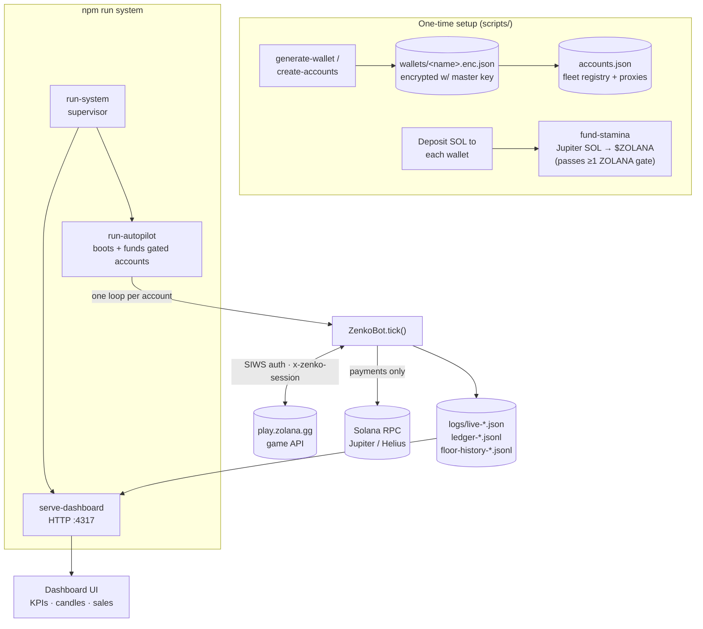
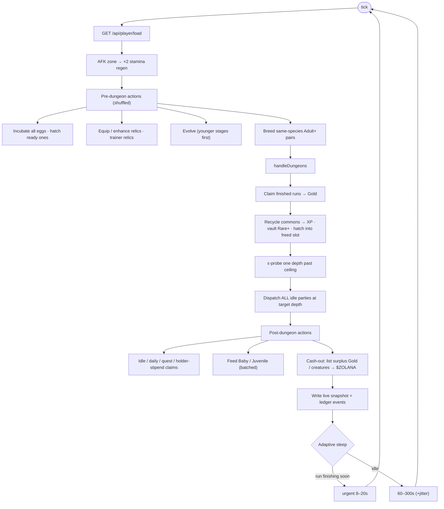

# Zenko Bot

Headless automation + wallet tooling for **[Zenko](https://play.zolana.gg)** (zolana.gg) — a Solana
creature-collector idle game. The bot logs in over the game's own HTTP API (no browser), grinds the
free / Gold economy across a fleet of accounts, breeds and evolves creatures, runs dungeons at the
deepest party-power the roster can clear, and lists surplus output on the in-game marketplace for
**$ZOLANA**. A local dashboard shows live state, NFT floor candles, and a sales log.

> ⚠️ **Use at your own risk.** This automates a live game against real on-chain value. It is provided
> for research and educational purposes. Automating a game may violate its Terms of Service, and any
> code that signs Solana transactions can move real funds — **read the money-safety section and audit
> every transaction path yourself before running it.** Keep your wallet keys and master key private.

---

## What it does

- **One event loop per account.** Each account runs an independent `ZenkoBot` tick loop with its own
  seeded jitter (action delays, tick cadence, boot stagger) so a fleet never acts in lockstep.
- **Full free/Gold game loop** — incubate & hatch eggs, place creatures, feed, evolve, breed, equip
  and enhance relics, run dungeons, and claim idle/daily/quest/holder rewards.
- **Self-calibrating dungeon depth.** The bot probes one step past its verified ceiling, raises the
  ceiling when the party clears it, and backs off when the server rejects for insufficient power.
- **Marketplace cash-out.** Once an account has scaled, it lists surplus Gold and eligible creatures
  for $ZOLANA using demand-based pricing — **seller-passive: it lists items, it never signs a buy tx.**
- **Live dashboard** — fleet KPIs, per-account cards, TradingView-style rarity floor candles, and a
  net-sales log, served from local telemetry files.

### Mechanics status

| Mechanic | Endpoint(s) | Status |
|---|---|---|
| Incubate & hatch | `egg/incubate`, `egg/hatch` | ✅ automated (hatches into freed roster slots same-tick) |
| Auto-place | `creature/place-auto` | ✅ automated |
| Feeding | `creature/feed` | ✅ Baby/Juvenile only, 11-min cooldown, batched per tick |
| Evolution | `creature/evolve` | ✅ stage-ups, XP-breaks timers under `gold-per-run`, un-vaults to evolve |
| Breeding | `breed` | ✅ same-species Adult+ pairs, multi-pair/tick, dedicated vault "nursery" |
| Dungeons | `dungeon/start`, `dungeon/claim` | ✅ multi-run dispatch, adaptive depth, ε-probe |
| Relics | `relic/equip`, `relic/enhance`, `relic/craft` | ✅ auto-equip best-per-slot, enhance, optional trainer forge |
| Selling | `market/list`, `market/cancel` | ✅ Gold + creatures, demand pricing, reprice, adaptive pacing |
| Rewards | `idle/claim`, `daily/claim`, `quests/claim`, `gems/hold-claim`, `epoch/claim` | ✅ automated |
| Stamina refill | `stamina/restore` | ⚙️ opt-in only — **burns $ZOLANA** (see money-safety) |

The reverse-engineered API contract lives in [`NOTES.md`](./NOTES.md).

---

## Architecture



### The per-account tick loop



---

## Money-safety model

The bot's core invariant: **by default it only touches free and Gold actions — never anything that
moves $ZOLANA or SOL.** This is enforced in two layers:

1. A `FORBIDDEN` list in `bot.js` hard-blocks money-moving endpoints (`stamina/restore`, `market/buy*`,
   `gacha/pull`, `gem/craft`, `epoch/donate`, `casino/*`, `zothebyz/*`) from the generic action path —
   calling one throws instead of hitting the network.
2. Anything that spends real value or is irreversible is **opt-in only**, gated behind an explicit flag,
   never default-on:
   - `autoBuyStamina` — sends a real on-chain $ZOLANA transfer to the game treasury to refill stamina.
   - `autoRecycleCreatures`, vault/sacrifice paths — permanently consume creatures for XP.

**Selling is seller-passive.** Listing an item on the marketplace signs nothing and moves no funds; the
*buyer* signs the atomic 2-leg payment. $ZOLANA only lands in a wallet when a human buyer pays. The buy
side (`market/buy`) is in `FORBIDDEN` and is never called.

> 🔐 **Wallet-signing code is security-critical. Verify `src/stamina.js`, `src/jupiter-swap.js`, and the
> `FORBIDDEN` list independently before enabling any opt-in money path.**

---

## Quick start

### Requirements
- Node.js ≥ 20 (uses the built-in test runner and `--watch`)
- A funded Solana wallet flow (SOL for gas + a Jupiter API key to auto-swap into $ZOLANA), or fund
  accounts manually
- Optional: a dedicated Solana RPC (Helius/Triton/QuickNode) — the public endpoint throttles the fleet
- Optional: HTTP(S) proxies (one per account is recommended for a fleet)

### 1. Install & configure
```bash
npm install
cp .env.example .env        # fill in SOLANA_RPC_URL, JUPITER_API_KEY, proxies
export ZENKO_MASTER_KEY=...  # wallet-encryption key — NEVER commit this, keep it in your shell
```

### 2. Create accounts (generates + encrypts wallets, writes the registry)
```bash
npm run create-accounts -- Alice Bob Carol
# → wallets/Alice.enc.json … , entries in accounts.json, proxies assigned from the pool
npm run accounts                    # list accounts + public deposit addresses
```

### 3. Fund the gate
Deposit a little SOL to each wallet's address, then swap into $ZOLANA to pass the "hold ≥ 1 $ZOLANA"
gate (Jupiter):
```bash
npm run fund-stamina -- --all --usd=1.3 --execute
```

### 4. Run
```bash
npm run system            # dashboard + farm loop for all live accounts (recommended)
# open http://localhost:4317

npm run autopilot -- --working   # farm only, accounts that already have a live snapshot
npm run web                      # dashboard only
```

`--working` starts only accounts with an existing `logs/live-*.json` snapshot; `--all` boots (and, with
`--execute`, funds) every registered account.

### Auto-rebalance (open the market on short accounts)

The marketplace requires holding ≥ 10,000 $ZOLANA to list. Accounts below that gate can't sell their
pets. `--rebalance` adds a background poller that moves **surplus** $ZOLANA (from wallets above the
13.5k donor floor) to short accounts **that actually have something to sell** — no point funding an
empty account. It keeps $ZOLANA *inside* the playing set (unlike a sweep, which pulls it out).

```bash
npm run system -- --rebalance                 # farm + dashboard + auto-rebalance (real transfers)
npm run system -- --rebalance --rebalance-min=15   # re-check every ~15 min (±20% jitter)
npm run rebalance                             # one-off DRY-RUN: print the plan, send nothing
npm run rebalance -- --execute --watch-min=20 # standalone poller (real transfers), no farm
```

The planner never drains a donor below the floor, uses non-round amounts + human pauses, and only funds
accounts with sellable pets or a Gold pile (`--no-gate` overrides). It needs `ZENKO_MASTER_KEY` set (same
as the farm). If no wallet is above the donor floor yet, it stays idle and funds accounts automatically
as sellers accumulate surplus.

---

## Scripts

| Command | What it does |
|---|---|
| `npm run system` | Supervisor: dashboard + farm, auto-restarts on source changes (`--watch`) |
| `npm run autopilot` | Boots accounts, funds ZOLANA-gated ones through Jupiter, runs the bot loop |
| `npm run bot` | Runs the bot loop for already-playable accounts |
| `npm run web` | Serves the dashboard only |
| `npm run create-accounts` | Generates encrypted wallets + registry entries |
| `npm run gen-wallet` | Generates a single encrypted wallet |
| `npm run accounts` | Lists accounts / deposit addresses (`--private-keys` to reveal, needs master key) |
| `npm run fund-stamina` | Swaps SOL → $ZOLANA via Jupiter to fund accounts |
| `npm run rebalance` | Rebalances $ZOLANA across the fleet (dry-run; `-- --execute` to send) |
| `npm run bootstrap` | Creates the in-game player for a wallet |
| `npm run market-smoke` | Read-only marketplace API probe |
| `npm run probe-species` | Read-only: confirm the market `species` field + show per-species metrics & ideal prices |

---

## Configuration

Runtime secrets come from `.env` (see `.env.example`); the wallet-encryption master key comes from the
`ZENKO_MASTER_KEY` shell variable and is never written to disk in plaintext.

Farm behaviour is defined in `src/startup-profile.js` (`farmTradingConfig`) and can be overridden
per-account via `readLiveStrategy`. Key knobs:

| Knob | Meaning |
|---|---|
| `depthObjective` | `gold-per-run` (unlimited resources → max XP/run) vs `gold-per-stamina` |
| `feedMaxPerTick`, `breedMaxPerTick` | Throughput caps that stay human-plausible |
| `autoBreedingPipeline`, `vaultBreedingPoolTarget` | Dedicated in-vault breeding "nursery" |
| `autoSellGold`, `cashoutGoldSellTrigger` | Gold cash-out hysteresis (accumulate, then drip-sell) |
| `cashoutDemandPricing` | Price at the median of real recent sales, don't undercut your own fleet |
| `cashoutSpeciesMinSamples` | Ideal price is parsed **per species** first (median of that species' sales), then rarity, then seed |
| `autoBuyStamina` | **Opt-in.** On-chain $ZOLANA burn to refill stamina |
| `tickMin/MaxSec`, `actionDelayMin/MaxMs` | Human-timing envelope (set per-account from jitter) |

Anti-detection is a first-class design constraint: per-account seeded RNG, randomized boot delays,
0.6–6.5 s pauses between individual API actions, 1–5 min idle tick cadence, action-order shuffling,
session-token persistence (real logins only ~every 8 h, not every restart), and maintenance backoff so
the fleet never storms a restarting server.

---

## Dashboard

`npm run web` (or the `system` supervisor) serves `public/dashboard.html` on `http://localhost:4317` (override with `PORT`):

- **KPIs** — net sales (ZOL/USD), fleet mark-to-market value, independent Jupiter ZOL price, 24 h
  breed/hatch pipeline, incubation load.
- **NFT floor candles** — per-rarity OHLC floor built from real market floor polls, with timeframe /
  currency / window toggles.
- **Account cards** — per-account gold, ZOL balance, stamina, roster/vault split, rarity mix, and a
  live mini-log.
- **Sales log** — deduplicated net sales in ZOL and USD.

Telemetry is read from `logs/` (git-ignored); an independent "profit today" estimate is computed
client-side because the game does not expose one via API.

---

## Project layout

```
src/            core modules (bot loop, client, breeding, marketplace, relics, stamina, ledger, …)
scripts/        entry points + one-off tooling (run-system, run-autopilot, create-accounts, …)
public/         self-contained dashboard (single HTML file)
test/           offline unit tests (node --test) — 226 tests, pure logic, no network
NOTES.md        reverse-engineered Zenko API contract
wallets/        encrypted wallets (git-ignored)
logs/           live telemetry + ledgers (git-ignored)
```

### Tests
```bash
node --test test/     # 226 offline unit tests (~1.3 s)
```
Do **not** run `node --test` over the whole repo — `scripts/test-*.js` are live-network probes that
require credentials, not unit tests.

---

## Security notes

- `.env`, `wallets/`, `accounts.json`, `master-key.txt`, proxy files, and `logs/` are git-ignored and
  must never be committed. The `ZENKO_MASTER_KEY` lives only in your shell.
- Wallet private keys are AES-encrypted at rest; `accounts.json` holds only public addresses + proxy
  references.
- This repository contains **no** private keys, seed phrases, or account credentials.
